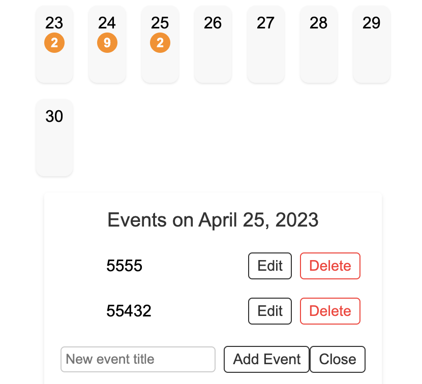

# calendar-app
I created a calendar app that can manage a daily event.  The front-end framework is VUE and back-end framework is Gin. In addition, I choose MongoDB to store data. You can create update, delete and add events on this calendar-app
### screenshot of calendar


### screenshot of manage events



## Project setup

To run this project, you need to install both VUE and Gin. Besides, make sure that MongoDB is started on your computer.

1. Installing Vue and go to frontend/calendar-app
```
npm install
```
2. Installing Gin 
If you do't have Go, please see [Go release page](https://go.dev/dl/)

```
go get -u github.com/gin-gonic/gin
```
3. Run front-end

```
npm run serve
```

4. Run back-end
```
go run main.go
```

5. Start MongoDB
```
You can change the connection method at /backend/main.go
mongoURI := "mongodb://localhost:27017/?directConnection=true"
```


### Compiles and hot-reloads for development


```
npm run serve
```

### Compiles and minifies for production
```
npm run build
```

### Customize configuration
See [Configuration Reference](https://cli.vuejs.org/config/).


